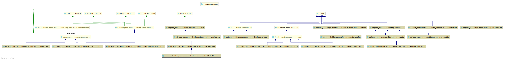

# Object Challenge


This project is a technical challenge project which is powered by flask, docker and openresty.

# important libraries

- [flask_pymongo][100]

  for connection to mongo db and operate mongo like queries.

- [flask-mongoengine][101]

  for defining mongo models and access to mongo throughout ORM

- [Flask-Script][102]

  for executing commands

- [flask-shell-ipython][103]

  interactive commandline

[100]: https://flask-pymongo.readthedocs.io/en/latest/

[101]: http://docs.mongoengine.org/projects/flask-mongoengine/en/latest/

[102]: https://flask-script.readthedocs.io/en/latest/

[103]: https://pypi.org/project/flask-shell-ipython/

# project structure

```
├── config.py
├── bucket
│   ├── fixtures
│   │   ├── user_prefixes.json
│   │   ├── users.json
│   │   └── prefixes.json
│   ├── services
│   │   ├── bucket.py
│   │   ├── __init__.py
│   ├── mongo_models
│   │   ├── user.py
│   │   ├── prefix.py
│   │   ├── user_prefix.py
│   │   ├── __init__.py
│   ├── views
│   │   ├── bucket.py
│   │   ├── __init__.py
│   ├── __init__.py
│   ├── tests
│   │   ├── test_config.py
│   │   ├── test_bucket.py
│   │   ├── base.py
│   │   └── __init__.py
├── __init__.py
├── tree.py
├── base
│   ├── namedtuples.py
│   ├── mixins.py
│   ├── data_loader.py
│   ├── __init__.py
└── helper.py
```

### flask app

flask app is defined under `object_challenge/__init__.py`

### flask configurations

flask app is defined under `object_challenge/config.py`

- **DevelopmentConfig**
- **TestingConfig**
- **ProductionConfig**

### mongo models

mongo models are defined under `object_challenge/mongo_models` directory.

- **prefixes**
- **users**
- **user_prefixes**

### urls

|   endpoint  |   action    |                payloads                   |   
|-------------|-------------|-------------------------------------------|
| `/bucket`   |   'POST'    |  `{'bucket':'bucket_name'}`               |
| `/arvan`    |   'POST'    |  `{'bucket':'bucket_name'}`               |

### sample request

```shell
curl -X POST \
  http://185.239.107.132/bucket \
  -H 'authorization: Token token_1' \
  -H 'content-type: application/json' \
  -d '{
	"bucket": "pushe3"
}'
```


# project diagram



# local setup

- install requirements
   ```shell script
  pip install -r requirements/development.txt
   ```
- load env
   ```shell script
  export  $(cat deployment/env_dir/flask.env | xargs)
   ```
- runserver
   ```shell script
  python manage.py runserver
   ```

# server setup

- install docker and setup github ssh keys
- ```
   git clone git@github.com:mohammadmasoumi/object_challenge.git
   ``` 
- ```
   cd /deployment
   ```
- ```
   docker-compose up -d 
   ```

# flask shell

This project use `flask-shell-ipython` as an interactive flask shell.

```shell script
python manage.py shell
```

# Commands

- run server command
    ```shell script
    python manage.py runserver
    ``` 
- run server command
    ```shell script
    python manage.py shell
    ``` 
- load initial data command. `object_challenge/object_challenge/fixtures`
    ```shell script
    python manage.py init
    ``` 

# Resources

- [How we reduced the CPU usage of our Lua code][1]
- [tree structure in python][2]
- [flask-script][3]
- [flask][4]
- [lua-nginx][5]

[1]: https://medium.com/@fabricebaumann/how-we-reduced-the-cpu-usage-of-our-lua-code-cc30d001a328

[2]: https://stackoverflow.com/questions/9727673/list-directory-tree-structure-in-python

[3]: https://flask-script.readthedocs.io/en/latest/

[4]: https://flask.palletsprojects.com/en/1.1.x/

[5]: https://www.nginx.com/resources/wiki/modules/lua/